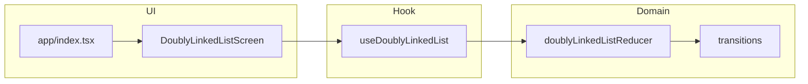

# Instructions

- Create a branch called `technical-challenge` for your work
- Update readme with instructions on how to run/test your code

# Challenge

## Doubly Linked List - React Version

We want you to implement a Doubly Linked List (DDL) in React. You will need to build the DDL data structure from scratch and create a visual, interactive representation of it.

### What is a Doubly Linked List?

A Doubly Linked List (DDL) is a linear data structure where each node contains data and two pointers: one to the previous node (`prev`) and one to the next node (`next`). Unlike a singly linked list, you can traverse in both directions. The list has a `head` (first node) and a `tail` (last node), where the head's `prev` is `null` and the tail's `next` is `null`.

### Requirements:

Build the DDL from scratch (no libraries or built-in data structures) and expose all operations through an interactive UI. Your code should be as performant as possible.

- Insert head / Insert tail: Add nodes at the beginning or end of the list.
- Remove an element: By index or value (your choice).
- Remove all duplicates: Keep only one occurrence of each value.
- Search: Return the element's index if found.
- Size: Display the current count of nodes.
- Visualize the list: Render nodes and their prev/next connections so the structure is visible.
- Display state: Show the current head, tail, and size at all times.

## Technical Requirements

- React 18+ with TypeScript
- Use React hooks for state management
- Visualize the list using divs, SVG, or whatever works — it doesn't need to be fancy, just clear
- Feel free to use any styling library (recommended for saving time)

## React Native Variant

If this challenge is assigned for a React Native role, implement the solution using React Native components (View, Text, TouchableOpacity, FlatList/ScrollView, TextInput, etc.) instead of HTML elements. The DDL logic, state management, and interactivity expectations remain identical. Your solution should run on a mobile simulator or Expo.

# Additional details

- You have 1 hour for this
- Make sure the DDL operations work correctlym, that's the most important part.
- Add comments if you want to explain your approach
- Once complete, please create a PR, assign yourself as the owner, and add the designated individual as the reviewer.

Good luck!

---

## Run and test (Expo / React Native)

This repo includes an **Expo (SDK 54)** app using **Expo Router**, **TypeScript**, and a **domain + hook** split: list transitions live under [`src/domain/doublyLinkedList/`](src/domain/doublyLinkedList/), and [`src/hooks/useDoublyLinkedList.ts`](src/hooks/useDoublyLinkedList.ts) exposes `useReducer`-only state (no `useState` for list UI). UI follows **atomic design** (atoms → molecules → organisms; no separate `templates` layer).

### Prerequisites

- Node.js 20+ recommended
- For iOS simulator: Xcode (macOS). For Android: Android Studio / emulator.

### Install

```sh
npm install
```

### Start

```sh
npm run start
```

Then press `i` for iOS, `a` for Android, or `w` for web from the Expo CLI, or run:

```sh
npm run ios
npm run android
npm run web
```

After changing `babel.config.js`, prefer a clean Metro cache:

```sh
npm run start:clear
```

### Project layout (high level)

- [`app/`](app/) — Expo Router routes
- [`src/components/atoms`](src/components/atoms) — smallest building blocks
- [`src/components/molecules`](src/components/molecules) — small compositions
- [`src/components/organisms`](src/components/organisms) — screen sections / shells
- [`src/domain/doublyLinkedList`](src/domain/doublyLinkedList) — pure list state + transitions
- [`src/hooks`](src/hooks) — React hooks wrapping reducers

### Tests and lint

```sh
npm test
npm run lint
```

---

## Architecture and engineering guidelines

The following is how this implementation is structured and how to extend it.

### Stack

| Area | Choice |
|------|--------|
| Runtime | **Expo SDK 54**, **React Native** (React Native variant of the challenge) |
| Navigation | **Expo Router** (`app/` file-based routes) |
| Language | **TypeScript** with `strict: true` |
| Styling | **StyleSheet** + shared tokens under `src/theme/` (no extra CSS-in-JS library) |
| Lint | **ESLint 9** flat config via **eslint-config-expo** |
| Unit / integration tests | **Jest** (`jest-expo`) + **@testing-library/react-native** |

### 1. Atomic UI (no `templates/` layer)

UI is organized as **atoms → molecules → organisms → routes**:

- **Atoms** (`src/components/atoms/`): smallest wrappers (`AppText`, `AppPressable`, `AppTextInput`, `ScreenContainer`). Convention: **`import React from 'react'`** in every JSX file; ESLint enforces `react/react-in-jsx-scope`.
- **Molecules** (`src/components/molecules/`): small compositions (`StatRow`, `SectionHeader`, `ListNodeCard`).
- **Organisms** (`src/components/organisms/`): screen sections (`DoublyLinkedListScreen`, `LinkedListVisualization`). Layout that would live in a “template” layer lives here or on the route.

There is **no** `src/components/templates/` folder by design.

### 2. Domain isolated from React

All list logic that can stay pure lives under **`src/domain/doublyLinkedList/`**:

| File | Responsibility |
|------|----------------|
| `types.ts` | State shape, actions, node types |
| `state.ts` | Initial state |
| `transitions.ts` | Pure transitions (insert head/tail, draft, reset) |
| `reducer.ts` | `doublyLinkedListReducer`: dispatches to transitions |
| `selectors.ts` | Read-only views (`getSize`, `getOrderedValues`, `getOrderedNodes`, `formatEndpoint`) |

The reducer stays **synchronous and side-effect free** so it is easy to test and reason about.

### 3. Hooks and state (no `useState` for list feature state)

- **`useDoublyLinkedList`** ([`src/hooks/useDoublyLinkedList.ts`](src/hooks/useDoublyLinkedList.ts)) is the **only** place list state is held: it uses **`useReducer`** with `doublyLinkedListReducer`.
- **No `useState`** for the list / draft / derived “view” slice: the draft lives in reducer state; derived values use **`useMemo`** from the same `state`.
- Components call **`actions.*`** (memoized dispatch wrappers), not raw `dispatch`, to keep call sites readable.

### 4. Module paths

**`@/*` → `src/*`** is configured in:

- `tsconfig.json` (`paths`)
- `babel.config.js` (`babel-plugin-module-resolver`)

Jest mirrors this in `jest.config.js` (`moduleNameMapper`).

### 5. Debugging

[`src/utils/ddlLog.ts`](src/utils/ddlLog.ts) logs only when **`__DEV__`** is true (presses, dispatches, reducer snapshots, transition skips). Remove or narrow logs once debugging is finished.

### 6. UX aligned with the reducer

Insert head/tail read **`draftValue.trim()`** in the domain. The UI therefore:

- **Disables** insert buttons when there is nothing to insert (after trim).
- Shows a short **hint** so behavior matches logs (empty draft → skipped insert).

### Data flow (high level)



### Testing strategy

| Layer | Tooling | Location | Rules |
|-------|---------|----------|--------|
| **Domain** | **Jest only** (no React, no RN) | `src/domain/doublyLinkedList/__tests__/*.test.ts` | Reducer, selectors, transitions; fast and framework-agnostic. |
| **Screen / integration** | **React Native Testing Library** + Jest | `src/components/organisms/__tests__/*.test.tsx` | User flows: type, press, assert stats / order / node `testID`s. |

**Jest / RN notes**

- **`react-native-safe-area-context`**: native `SafeAreaView` does not expose children to RNTL’s tree the same way in tests. **`jest.preset-mocks.ts`** (loaded first in `setupFilesAfterEnv`) replaces **`SafeAreaView`** with **`View`** and provides a lightweight **`SafeAreaProvider`** so the screen tree is queryable.
- **`eslint.config.js`**: Expo flat config is **spread** (`...expoFlat`) so plugin blocks are not nested incorrectly. `eslint.config.js` relaxes `@typescript-eslint/no-require-imports` for `jest.preset-mocks.ts` / `jest.setup.ts` where `require` in the mock factory is intentional.

### Tooling and scripts

| Script | Purpose |
|--------|---------|
| `npm run start` | Expo dev server |
| `npm run start:clear` | Same with **Metro cache cleared** (use after `babel.config.js` changes) |
| `npm run ios` / `android` / `web` | Platform entrypoints |
| `npm test` / `npm run test:watch` | Jest |
| `npm run lint` | `expo lint` (ESLint) |

**Babel:** `babel-preset-expo` only; the deprecated **`expo-router/babel`** plugin is **not** used (SDK 54 guidance).

### Git workflow

- **Branch:** `technical-challenge` (per hiring instructions above).
- **Commits:** Prefer [**Conventional Commits**](https://www.conventionalcommits.org/) (`feat:`, `fix:`, `chore:`, `test:`, `docs:`, …) with **small, focused** commits.
- **Remote:** Point `origin` at your fork (e.g. `https://github.com/<you>/doubly-linked-list-react.git`) before pushing.

### Implemented vs challenge checklist

**Implemented**

- Insert head / insert tail (from trimmed draft).
- Size, head, tail display.
- Visualization: ordered **node cards** with **prev / next** and head→tail strip.
- Reset.
- TypeScript + hooks + tests.

**Still to implement** (extend domain + UI + tests together)

- Remove by index or value.
- Remove duplicates.
- Search by index.

Extend **`DoublyLinkedListAction`**, **`transitions.ts`**, **`reducer`**, **`selectors`**, UI, and **domain tests** so the same patterns stay intact.
